# github-profile-widgets

Minimal SVG widgets for your GitHub profile README, generated by GitHub Actions.

<p>
  <br/><br/>
  <br/><br/><br/>
  <br/><br/><br/>
  <br/><br/><br/>
  <br/><br/><br/>
  
</p>

## Usage

Add `.github/workflows/widgets.yml` to your profile repository (`<you>/<you>`):

```yaml
name: Profile widgets

on:
  schedule:
    - cron: "0 0 * * *"
  workflow_dispatch:

permissions:
  contents: write

jobs:
  widgets:
    runs-on: ubuntu-latest
    steps:
      - uses: actions/checkout@v4
      - uses: k-s0ma/github-profile-widgets@v1
```

Run it once from the **Actions** tab, then add the SVGs in `assets/` to your README:

```html

```

Files: `name`, `dots-line`, `dots-grid`, `numbers`, `languages`, `clock`, `hours-punch` (`.svg`).

Options (colors, time zone, etc.) are listed in [action.yml](action.yml).

## License

[MIT](LICENSE). Font: D-DIN, [SIL Open Font License 1.1](fonts/D-DIN-LICENSE.txt).
